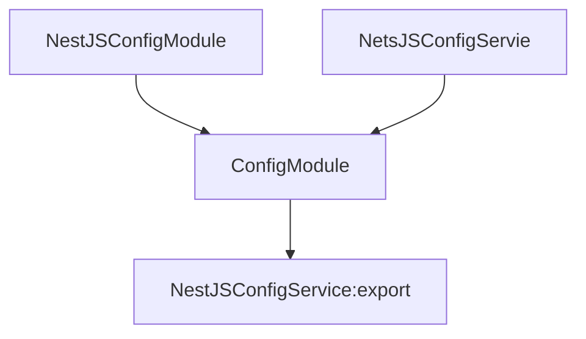
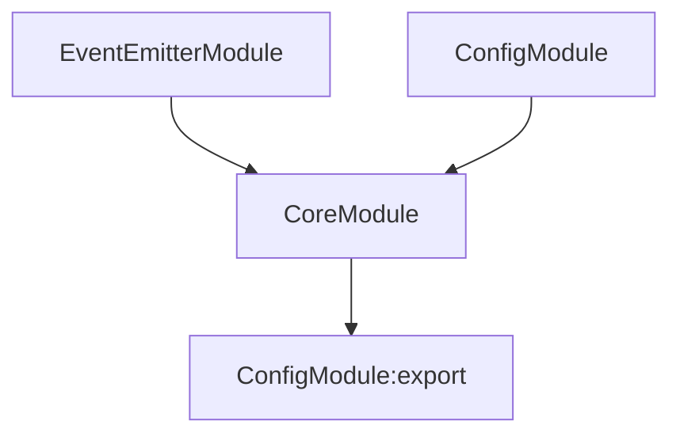
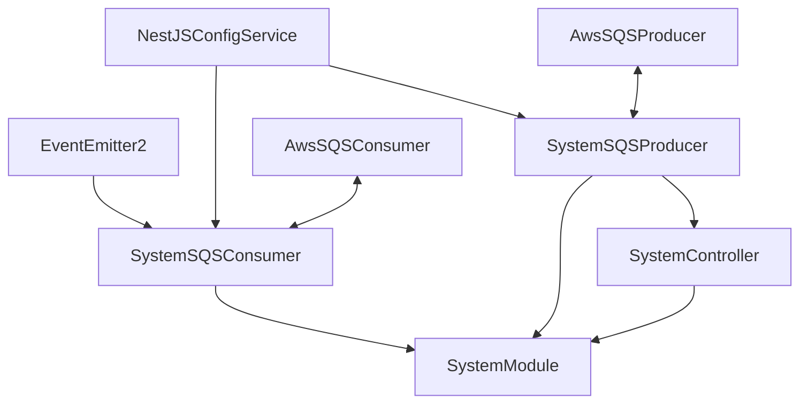
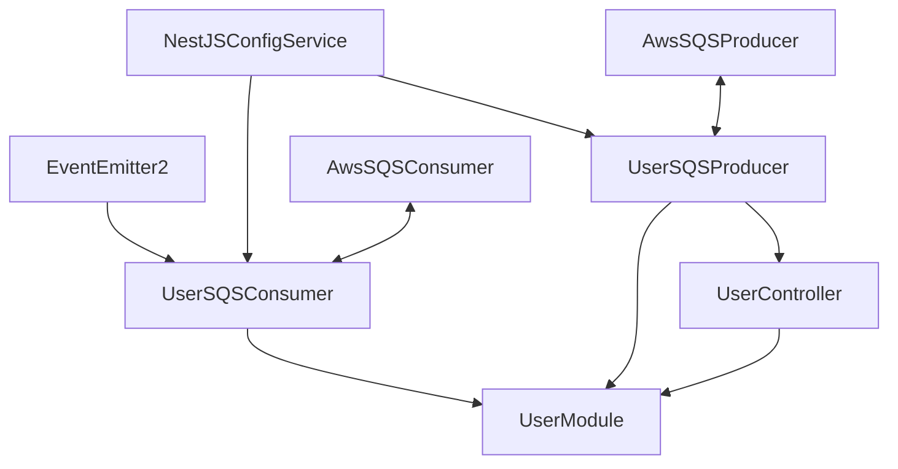
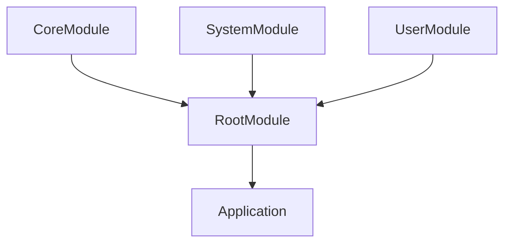
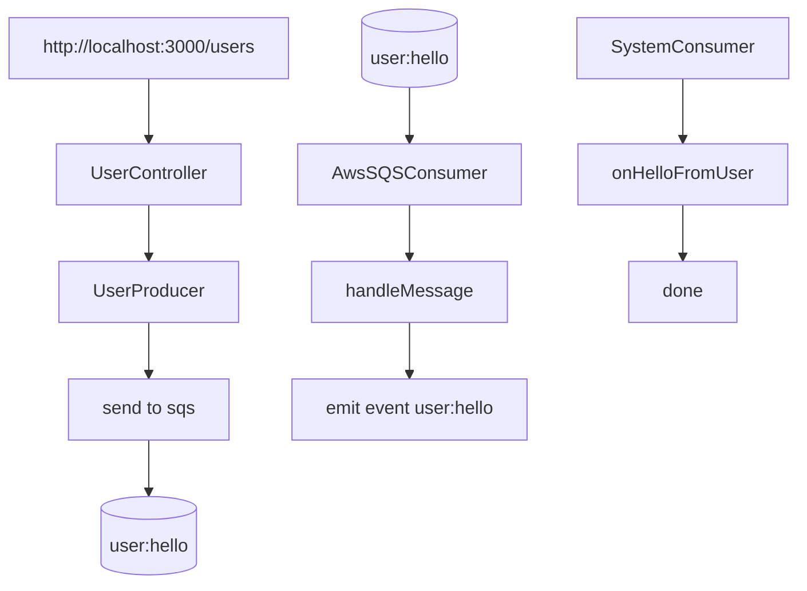
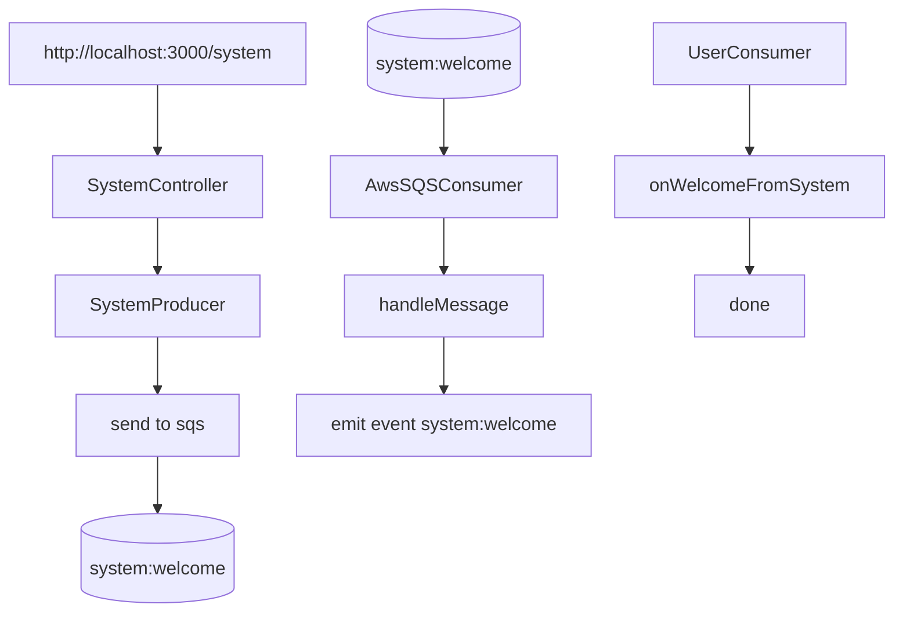

# NestJS Aws SQS Test with Docker(Local Stack)

## Initialize

### Install

```zsh
npm install
```

### Create `.env` file

```zsh
npm run env
```

### Run local-stack with docker

```zsh
npm run docker
```

### Test

```zsh
npm run test
```

## Structures

### ConfigModule



### CoreModule



### SystemModule



### UserModule



### RootModule



## Logic

### User to System

```zsh
curl -X POST "http://localhost:3000/users"
```



### System to User

```zsh
curl -X POST "http://localhost:3000/system"
```


